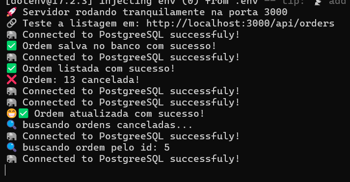
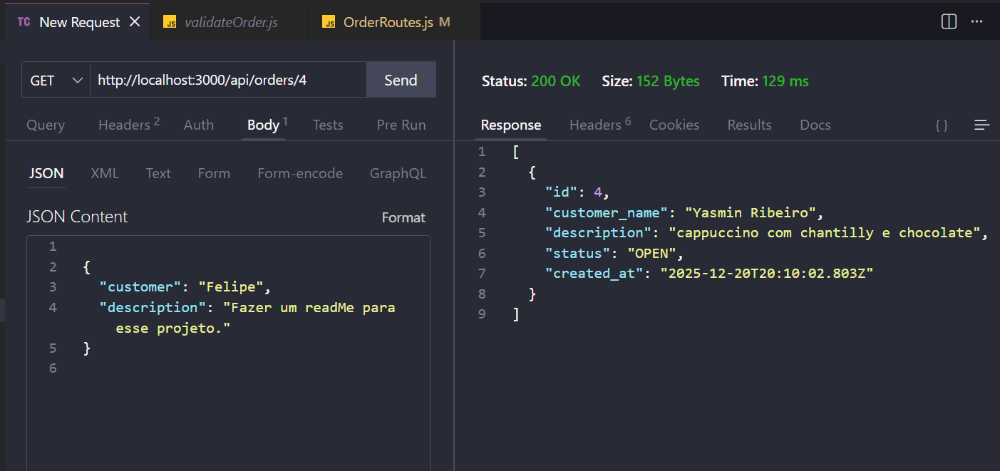
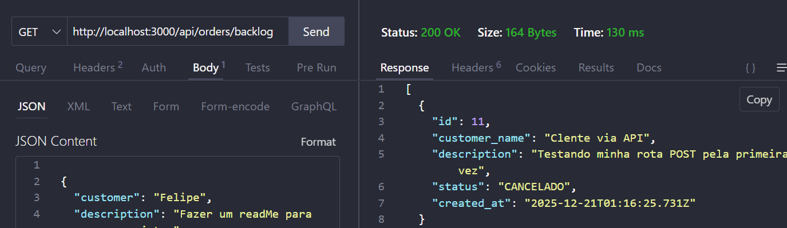

# 🛠️ Sistema de Gerenciamento de Ordens de Serviço

API RESTful desenvolvida para facilitar o controle de chamados técnicos, utilizando uma arquitetura profissional e persistência em banco de dados relacional.

## 🏗️ Arquitetura e Diferenciais

O projeto foi construído com foco em **Clean Code** e **Segurança**, apresentando as seguintes camadas:

* **Routes**: Definição de endpoints semânticos e captura de parâmetros dinâmicos.
* **Controllers**: Lógica de negócio e comunicação direta com o banco de dados via `pg-pool`.
* **Middlewares**: Camada de interceptação para validação de campos obrigatórios antes do processamento.
* **Soft Delete**: Estratégia de segurança que evita a perda de dados, marcando registros como `CANCELADO` em vez de excluí-los fisicamente.
* **Status Semânticos**: Uso correto de códigos HTTP, como `410 Gone` para recursos removidos e `404 Not Found` para buscas inexistentes.

## 🛣️ Endpoints (API Reference)

Abaixo, os comandos para interagir com a API via ferramentas como **Thunder Client** ou **Postman**:

### 📦 Ordens de Serviço
| Método | Endpoint | Descrição |
| :--- | :--- | :--- |
| `GET` | `/api/orders` | Lista todas as ordens com status ativo. |
| `GET` | `/api/orders/:id` | Busca uma ordem específica pelo ID (Retorna 410 se deletada). |
| `GET` | `/api/orders/backlog` | Filtro exclusivo para visualizar apenas ordens canceladas. |
| `POST` | `/api/orders` | Cria uma ordem (Campos `customer` e `description` obrigatórios). |
| `PUT` | `/api/orders/:id` | Atualiza o status de uma ordem (Ex: de OPEN para FINISHED). |
| `DELETE` | `/api/orders/:id` | Executa a exclusão lógica (Soft Delete) alterando o status. |

## 🛠️ Tecnologias Utilizadas

* **Node.js**: Ambiente de execução.
* **Express**: Framework web para roteamento.
* **PostgreSQL**: Banco de dados relacional.
* **Dotenv**: Gerenciamento de variáveis de ambiente.

## ⚙️ Instalação e Setup

1. **Clone o repositório**:
   ````bash
   git clone https://github.com/FelipeSpinola008/ordem-servico.git

2. **Instale as dependências**: 
    ````bash
    npm install

3. **Configure as variáveis de ambiente (.env): Crie um arquivo .env na raiz do projeto com suas credenciais do Postgres:**
    ````bash
    DB_USER=seu_usuario
    DB_HOST=localhost
    DB_NAME=ordem_servico
    DB_PASSWORD=sua_senha
    DB_PORT=5432

4. **Inicie o servidor**
    ````bash
    node app.js

## 📸 Demonstração da API

Aqui estão alguns registros do sistema em funcionamento, validados via terminal e Thunder Client:

### 1. Fluxo Completo no Terminal
Visualização dos logs de sucesso para operações de salvamento, listagem e atualização.


### 2. Busca por ID Específico
Exemplo de retorno de dados filtrados para um único cliente.


### 3. Segurança e Auditoria (410 Gone)
Demonstração da "Defesa" da API: ao tentar acessar uma ordem cancelada, o sistema retorna o status correto de recurso removido.


### 4. Backlog de Ordens Canceladas
Visualização da rota exclusiva para auditoria de ordens que foram removidas da listagem principal.


## 📬 Contato

Gostou do projeto ou tem alguma sugestão? Vamos conectar!

[](https://www.linkedin.com/in/felipespinola008/)
---

### 📝 Considerações Finais
Este projeto foi um marco importante no meu aprendizado de **Backend**, onde pude aplicar conceitos reais de arquitetura e segurança. Agradeço por ter chegado até aqui! 🚀